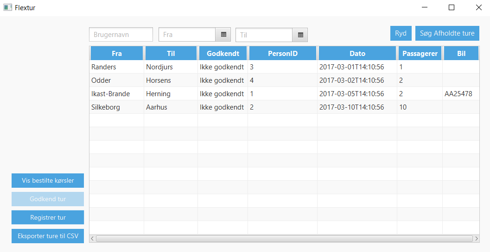
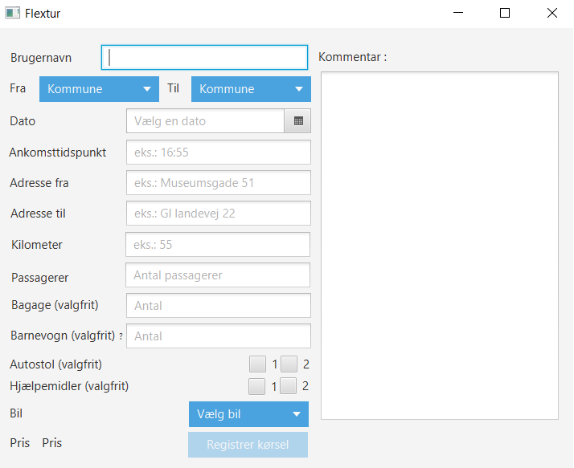
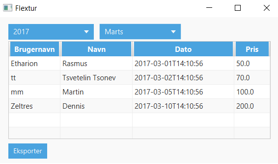
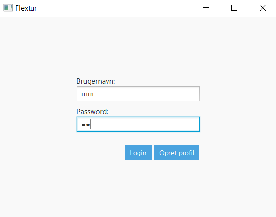
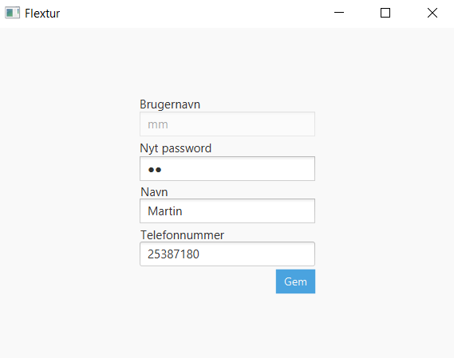

## Flextrafik summary

We used Unified Process to develop this app. We chose JavaFX as a Java desktop platform, Scene Builder for creating the views and MySQL as a data storage system. 
We designed the software following the MVC pattern, segregated it in three layers and we applied most of the GRASP principles.

### Screenshots
---
####Administration main view

####Route creation view

####CSV export view

####Login view

####Edit profile view

